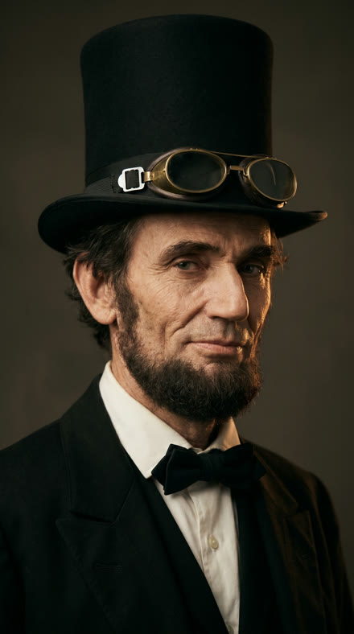
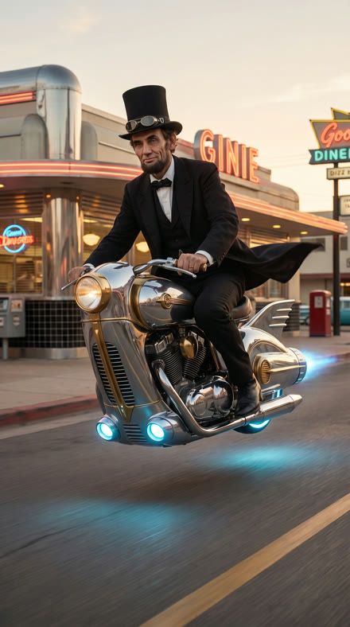
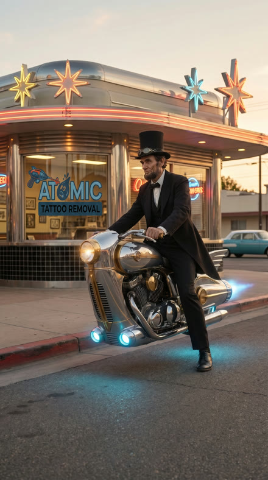
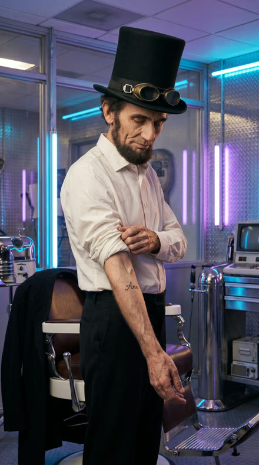
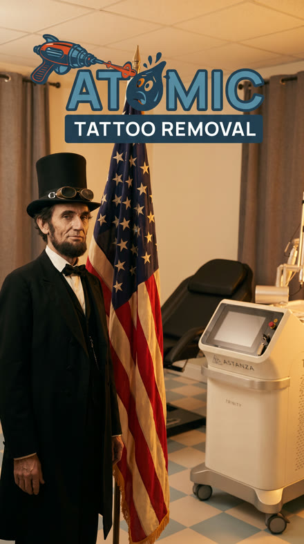

# fb-ad-studio

An agent-driven pipeline for producing Facebook / Instagram video ads, one stage
at a time, with a human review gate between every stage.

> **📖 New here? Start with the [User Guide](USERGUIDE.md).** A step-by-step,
> no-jargon walkthrough: what this is, how to make an ad, how to make it your own,
> which files to edit, and why fal.ai — written for someone who's never heard of
> "ICM."

It follows the **Interpretable Context Methodology (ICM)**: the "program" is this
folder of staged markdown instructions plus a few deterministic Python tools.
Claude Code reads the applicable stage file, does the creative work, calls a tool
when generation is needed, and stops at each review gate. It is a sibling of the
`spritesheet-animation-tool` project and reuses the same fal.ai calling pattern.

## The pipeline

```text
001 ideas        brainstorm offers + angles            -> user picks one
002 script       promote idea -> ad copy + beat sheet   -> user approves
003 storyboard   beat sheet -> scene-by-scene board     -> user approves
004 images       AI scenes -> 9:16 stills (fal image)    -> user approves
005 clips        approved stills -> 5s clips (fal Kling) -> user approves
006 shot list    assemble editor handoff + real-footage slots
```

Scenes are tagged by source: `AI_CLIP`, `AI_IMAGE`, or `REAL_FOOTAGE`. AI stages
only generate the AI scenes. Real footage (e.g. the laser in action) is captured
by the human; the shot list tells them exactly what to shoot and where it slots.

Final deliverable is **individual 5-second 1080×1920 clips + a shot list**, not a
finished video. A human edits the clips and real footage together (CapCut,
Premiere, etc.) and adds the text overlays.

## Why this workflow

**Consistent characters and style across every shot.** Lock one reference image,
and every scene anchors to it — so the *same* character appears across wildly
different poses, environments, and lighting. Below is a single AI "Abe Lincoln
look-alike," locked once and carried through an entire ad — portrait → riding a
hover cycle → arriving at the storefront → the coat-off reveal → the 250th
end-card. Same man every time:

<p align="center">
  
  
  
  
  
</p>

**The right AI model for each shot — not one-size-fits-all.** Video models each
have different strengths, so the generation tools are **model-agnostic**
(`--model`) and the workflow **recommends the best model per shot**:

- **Premium hero motion** → Veo 3.1 (the hover-cycle ride)
- **Text that must stay crisp** → Seedance with start/end frames (keeping the
  "Ann" tattoo legible through a laser close-up)
- **Cheap volume** → Kling  ·  **Natural human body motion** → Hailuo

And when a model fights you, you just switch. In this very ad, Veo's content
filter rejected a photoreal treatment close-up three times — a one-flag change to
Seedance and it went through. One key, many models, no lock-in.

**Also:**
- **Human-in-the-loop and fully inspectable** — every step is a review gate, and
  the whole "program" is plain-English files you can open and edit.
- **Cost transparency** — per-ad spend and remaining balance are tracked
  (`tools/fal_cost.py`).
- **Reusable across brands** — swap one brand profile to retarget the whole thing.
- **Correct sizing baked in** — every asset is validated against Meta's specs.

## Layout

```text
brand/            brand profiles (offer, voice, audience, assets). Atomic first.
reference/        specs + methodology + fal setup + stage instructions
  facebook-ad-specs.md   canonical Meta sizes, safe zones, copy limits
  methodology.md         the ad-building method distilled (Van Clief + ICM)
  workflow.md            pipeline contract + review gates
  fal-generation.md      fal.ai setup for image + video tools
  stages/                one file per stage, 001..006
  templates/             artifact templates the stages fill in
tools/            generate_image.py, generate_video.py, build_shot_list.py
work/             per-campaign working files (one folder per campaign)
output/           finished per-campaign deliverables (clips + shot list)
```

## Working directories

Each campaign gets one folder under `work/<campaign>/` with numbered
subfolders matching the stages:

```text
work/<campaign>/
├── 01-ideas/
├── 02-script/
├── 03-storyboard/
├── 04-images/
├── 05-clips/
└── 06-shot-list/
```

Finished deliverables are copied to `output/<campaign>/`.

## Quick start

1. Set your fal.ai key (see `reference/fal-generation.md`): put it in a `.fal_key`
   file at the repo root, or `export FAL_KEY=...`.
2. Tell Claude what you want, **including the offer**, e.g. *"Make a Mother's Day
   ad for Atomic — offer is free consultation + $50 off the first package."*
   Claude starts at stage 001 and walks the pipeline, pausing at each gate. If you
   don't state an offer, Claude asks for it before generating concepts (the offer
   is a required per-ad input — the offer beats the ad).

## Agent entry point

Agents: read `AGENTS.md` first. It defines the bootstrap order and stage routing.
